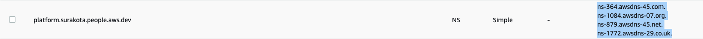
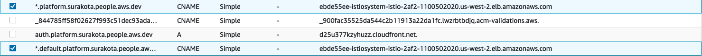
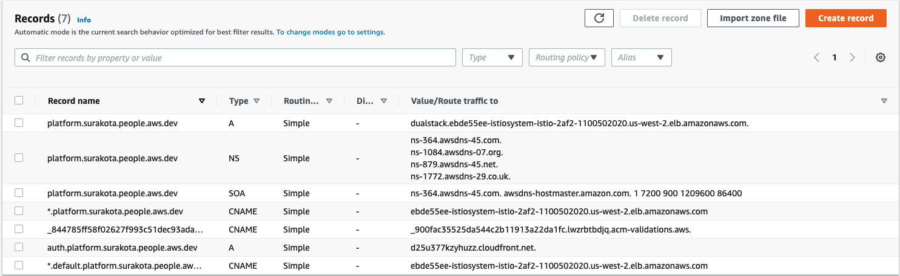

# Deploying Kubeflow with AWS Cognito as idP

This guide describes how to deploy Kubeflow on AWS EKS using Cognito as identity provider. Kubeflow uses Istio to manage internal traffic. In this guide we will be creating an Ingress to manage external traffic to the Kubernetes services and an Application Load Balancer(ALB) to provide public DNS and enable TLS authentication at the load balancer. We will also be creating a custom domain to host Kubeflow since certificates(needed for TLS) for ALB's public DNS names are not supported.

## Prerequisites

This guide assumes that you have:

1. Installed the following tools on the client machine
    - [AWS CLI](https://docs.aws.amazon.com/cli/latest/userguide/getting-started-install.html) - A command line tool for interacting with AWS services.
    - [eksctl](https://eksctl.io/introduction/#installation) - A command line tool for working with EKS clusters.
    - [kubectl](https://kubernetes.io/docs/tasks/tools) - A command line tool for working with Kubernetes clusters.
    - [yq](https://mikefarah.gitbook.io/yq) - A command line tool for YAML processing. (For Linux environments, use the [wget plain binary installation](https://github.com/mikefarah/yq/#install))
    - [jq](https://stedolan.github.io/jq/download/) - A command line tool for processing JSON.
    - [kustomize version 3.2.0](https://github.com/kubernetes-sigs/kustomize/releases/tag/v3.2.0) - A command line tool to customize Kubernetes objects through a kustomization file.
      - :warning: Kubeflow 1.3.0 is not compatible with the latest versions of of kustomize 4.x. This is due to changes in the order resources are sorted and printed. Please see [kubernetes-sigs/kustomize#3794](https://github.com/kubernetes-sigs/kustomize/issues/3794) and [kubeflow/manifests#1797](https://github.com/kubeflow/manifests/issues/1797). We know this is not ideal and are working with the upstream kustomize team to add support for the latest versions of kustomize as soon as we can.

1. Created an EKS cluster
    - If you do not have an existing cluster, run the following command to create an EKS cluster. More details about cluster creation via `eksctl` can be found [here](https://eksctl.io/usage/creating-and-managing-clusters/).
    - Substitute values for the CLUSTER_NAME and CLUSTER_REGION in the script below
        ```
        export CLUSTER_NAME=$CLUSTER_NAME
        export CLUSTER_REGION=$CLUSTER_REGION
        eksctl create cluster \
        --name ${CLUSTER_NAME} \
        --version 1.19 \
        --region ${CLUSTER_REGION} \
        --nodegroup-name linux-nodes \
        --node-type m5.xlarge \
        --nodes 5 \
        --nodes-min 1 \
        --nodes-max 10 \
        --managed
        ```
1. AWS IAM permissions to create roles and attach policies to roles.

1. Clone the `awslabs/kubeflow-manifest` repo and checkout release branch.
    1. ```
        git clone https://github.com/awslabs/kubeflow-manifests.git
        cd kubeflow-manifests
        git checkout v1.3-branch
        ```

**Tip:** The following sections in this guide walks you through each step for setting up domain, certificates and Cognito userpool and is good for a new user to understand the setup. If you prefer a automated setup for setting up these pre-requisites for deploying Kubeflow with Cognito, follow this [README](./README-automated.md)

## 1.0 Custom domain

Register a domain in any domain provider like [Route 53](https://docs.aws.amazon.com/Route53/latest/DeveloperGuide/domain-register.html) or GoDaddy.com etc. Lets assume this domain is `example.com`. It is handy to have a domain managed by Route53 to deal with all the DNS records you will have to add (wildcard for istio-ingressgateway, validation for the certificate manager, etc). In case your `example.com` zone is not managed by Route53, you need to delegate a [subdomain management in a Route53 hosted zone](https://docs.aws.amazon.com/Route53/latest/DeveloperGuide/CreatingNewSubdomain.html). For uniformity, we have delegated the subdomain `platform.example.com` in this guide so your root domain can be registered anywhere. Follow these steps to configure the subdomain:

1. Goto Route53 and create a subdomain to host kubeflow:
    1. Create a hosted zone for the desired subdomain e.g. `platform.example.com`.
    1. Copy the value of NS type record from the subdomain hosted zone (`platform.example.com`)
        1. 
    1. Create a `NS` type of record in the root `example.com` hosted zone for the subdomain `platform.example.com`.
        1. 
        1.  Following is a screenshot of the record after creation in `example.com` hosted zone.
            1. 
1. From this step onwards, we will be creating/updating the DNS records **only in the subdomain**. All the screenshots of hosted zone in the following sections/steps of this guide are for the subdomain.
1. In order to make Cognito to use custom domain name, A record is required to resolve `platform.example.com` as root domain, which can be a Route53 Alias to the ALB as well. Create a new record of type `A` with an arbitrary IP for now. Once we have ALB created, we will update the value later.
    1. Following is a screenshot of `platform.example.com` hosted zone. A record is shown. 
        1. 

## 2.0 Certificate

In this section, we will be creating certificate to enable TLS authentication at Application Load Balancer. Create the certificates for the domains in the regions mentioned below by following [this document](https://docs.aws.amazon.com/acm/latest/userguide/gs-acm-request-public.html#request-public-console) in the specified order.

> **Note:**
> - The ceritificates are valid only after successful [validation of domain ownership](https://docs.aws.amazon.com/acm/latest/userguide/domain-ownership-validation.html)
    - Following is a screenshot showing a certificate has been issued. Note: Status turns to `Issued` after few minutes of validation.
        - 
> - If you choose DNS validation for the validation of the certificates, you will be asked to create a CNAME type record in the hosted zone.
    - Following is a screenshot of CNAME record of the certificate in `platform.example.com` hosted zone for DNS validation:
            -     

1. Create a certificate in N.Virginia (us-east-1) for `*.example.com`.
1. Create a certificate in N.Virginia (us-east-1) for `*.platform.example.com`. That is because [Cognito requires](https://docs.aws.amazon.com/cognito/latest/developerguide/cognito-user-pools-add-custom-domain.html) a certificate in N.Virginia in order to have a custom domain for a user pool.
1. Create a certificate for `*.platform.example.com` in the region where your platform will be running(i.e. EKS cluster region). This required by the ingress-gateway in case the platform does not run in N.Virginia, in this example, Oregon.

## 3.0 Cognito User Pool

1. Create a user pool in Cognito in the same region as your EKS cluster. Type a pool name and choose `Review defaults` and `Create pool`.
1. Add an `App client` with any name and the default options.
    1. 
1. In the `App client settings`, select `Authorization code grant` flow under OAuth-2.0 and check box `email`, `openid`, `aws.cognito.signin.user.admin` and `profile` scopes. Also check box `Enabled Identity Providers`. 
    1. Substitute `example.com` in this URL - `https://kubeflow.platform.example.com/oauth2/idpresponse` with your domain and use it as the Callback URL(s).
    2. 
1. In the `Domain name` choose `Use your domain`, type `auth.platform.example.com` and select the `*.platform.example.com` AWS managed certificate you’ve created in N.Virginia. Creating domain takes up to 15 mins.
    1. 
    2. When it’s created, it will return the `Alias target` CloudFront address.
        1. Screenshot of the CloudFront URL for Cognito Domain name:
            1. 
        2.  Create a new record of type `A` for `auth.platform.example.com` with the value of the CloudFront URL.
            1. Select the `alias` toggle and select Alias to Cloudfront distribution for creating the record
            2. 
            3. Following is a screenshot of the A record for `auth.platform.example.com` in `platform.example.com` hosted zone:
                1. 

## 4.0 Configure Ingress

1. Take note of the following values from the previous step or `distributions/aws/infra_configs/scripts/config.yaml` if you used automated guide(./README-automated.md):
    1. The Pool ARN of the user pool found in Cognito general settings.
    1. The App client id, found in Cognito App clients.
    1. The custom user pool domain (e.g. `auth.platform.example.com`), found in the Cognito domain name.
    1. The ARN of the certificate from the Certificate Manager in the region where your platform (for the subdomain) in the region where your platform is running.
    1. Export the values:
        1. ```
            export CognitoUserPoolArn=<>
            export CognitoAppClientId=<>
            export CognitoUserPoolDomain=<>
            export certArn=<>
            ```
1. Verify you are connected to right cluster, cluster has compute and the aws region is set to the region of cluster.
    1. Substitute the value of CLUSTER_REGION below
        ```
        export CLUSTER_REGION=<>
        aws configure set region $CLUSTER_REGION
        ```
    1. Substitute the value of CLUSTER_NAME below
        ```
        export CLUSTER_NAME=<>   
        # Display the current cluster kubeconfig points to
        kubectl config current-context
        kubectl get nodes
        aws eks describe-cluster --name $CLUSTER_NAME
        ```
    1. Verify the current directory is the root of the repository by running the following command
        ```
        # the output should be <path/to/kubeflow-manifests> directory
        pwd
        ```
1. Substitute values for setting up Ingress.
    1. ```
        printf '
        CognitoUserPoolArn='$CognitoUserPoolArn'
        CognitoAppClientId='$CognitoAppClientId'
        CognitoUserPoolDomain='$CognitoUserPoolDomain'
        certArn='$certArn'
        ' > distributions/aws/istio-ingress/overlays/cognito/params.env
        ```
1. Setup resources required for the application load balancer controller
    1. Make sure all the subnets(public and private) corresponding to the EKS cluster are tagged according to the `Prerequisites` section in this [document](https://docs.aws.amazon.com/eks/latest/userguide/alb-ingress.html). Ignore the requirement to have an existing ALB provisioned on the cluster. We will be deploying ALB controller version 1.1.5 in the later section.
        1. Specifically check if the following tags exist on the subnets:
            1. `kubernetes.io/cluster/cluster-name` (replace `cluster-name` with your cluster name e.g. `kubernetes.io/cluster/my-k8s-cluster`). Add this tag in both private and public subnets. If you created the cluster using eksctl, you might be missing only this tag. Use the following command to tag all subnets by substituting the value of `TAG_VALUE` variable(`owned` or `shared`):
                - ```
                    export KIO_TAG_VALUE=<>
                    export CLUSTER_SUBNET_IDS=$(aws ec2 describe-subnets --region $CLUSTER_REGION --filters Name=tag:alpha.eksctl.io/cluster-name,Values=$CLUSTER_NAME | jq -r '.Subnets[].SubnetId')
                    for i in "${CLUSTER_SUBNET_IDS[@]}"
                    do
                        aws ec2 create-tags --resources ${i} --tags Key=kubernetes.io/cluster/${CLUSTER_NAME},Value=${KIO_TAG_VALUE}
                    done
                    ```
            1. `kubernetes.io/role/internal-elb`. Add this tag only to private subnet
            1. `kubernetes.io/role/elb`. Add this tag only to public subnet.
    1. Create an IAM role to use via service account. [IAM roles for service accounts (IRSA)](https://docs.aws.amazon.com/eks/latest/userguide/iam-roles-for-service-accounts.html) allows fine-grained roles at the Kubernetes Pod level by combining an OpenID Connect (OIDC) identity provider with Kubernetes Service Account annotations. In this section, we will associate the EKS cluster with an OIDC provider and create an IAM role which will be assumed by the ALB and profiles controller Pod via its Service Account to access AWS services.
        1. ```
            # Verify cluster name and region are exported
            echo $CLUSTER_REGION
            echo $CLUSTER_NAME
            ```
        1. ```
            export AWS_ACCOUNT_ID=$(aws sts get-caller-identity --query "Account" --output text)
            
            eksctl utils associate-iam-oidc-provider --cluster ${CLUSTER_NAME} \
            --region ${CLUSTER_REGION} --approve
            
            export OIDC_PROVIDER_URL=$(aws eks describe-cluster --name $CLUSTER_NAME --region $CLUSTER_REGION --query "cluster.identity.oidc.issuer" --output text | cut -c9-)
            export IRSA_ROLE_NAME=kf-admin-${CLUSTER_REGION}-${CLUSTER_NAME}
            
            printf '{
                "Version": "2012-10-17",
                "Statement": [
                {
                    "Effect": "Allow",
                    "Principal": {
                    "Federated": "arn:aws:iam::'$AWS_ACCOUNT_ID':oidc-provider/'$OIDC_PROVIDER_URL'"
                    },
                    "Action": "sts:AssumeRoleWithWebIdentity",
                    "Condition": {
                    "StringEquals": {
                        "'$OIDC_PROVIDER_URL':aud": "sts.amazonaws.com",
                        "'$OIDC_PROVIDER_URL':sub": [
                        "system:serviceaccount:kubeflow:alb-ingress-controller",
                        "system:serviceaccount:kubeflow:profiles-controller-service-account"
                        ]
                    }
                    }
                }
                ]
            }
            ' > ./trust.json
            
            
            aws iam create-role --role-name $IRSA_ROLE_NAME --assume-role-policy-document file://trust.json
            aws iam put-role-policy --role-name $IRSA_ROLE_NAME --policy-name iam_alb_ingress_policy --policy-document file://distributions/aws/infra_configs/iam_alb_ingress_policy.json
            aws iam put-role-policy --role-name $IRSA_ROLE_NAME --policy-name iam_profile_controller_policy --policy-document file://distributions/aws/infra_configs/iam_profile_controller_policy.json
            
            export IAM_ROLE_ARN_FOR_IRSA=$(aws iam get-role --role-name $IRSA_ROLE_NAME --output text --query 'Role.Arn')
            ```
    1. Annotate the service accounts with the IAM role
        1. ```
            yq e '.metadata.annotations."eks.amazonaws.com/role-arn" = env(IAM_ROLE_ARN_FOR_IRSA)' -i distributions/aws/aws-alb-ingress-controller/base/service-account.yaml
            yq e '.metadata.annotations."eks.amazonaws.com/role-arn" = env(IAM_ROLE_ARN_FOR_IRSA)' -i apps/profiles/upstream/manager/service-account.yaml
            ```
    1. Substitute values for ALB deployment
        1. ```
            printf 'clusterName='$CLUSTER_NAME'' > distributions/aws/aws-alb-ingress-controller/base/params.env
            ```
## 5.0 Building manifests and deploying Kubeflow

1. Deploy Kubeflow. Choose one of the two options to deploy kubeflow:
    1. **[Option 1]** Install with a single command
        ```
        while ! kustomize build distributions/aws/examples/cognito | kubectl apply -f -; do echo "Retrying to apply resources"; sleep 10; done
        ```
    1. **[Option 2]** Install individual components
        ```
        # Kubeflow namespace
        kustomize build common/kubeflow-namespace/base | kubectl apply -f -
        
        # Kubeflow Roles
        kustomize build common/kubeflow-roles/base | kubectl apply -f -
        
        # Istio
        kustomize build common/istio-1-9/istio-crds/base | kubectl apply -f -
        kustomize build common/istio-1-9/istio-namespace/base | kubectl apply -f -
        kustomize build common/istio-1-9/istio-install/base | kubectl apply -f -
        
        # Cert-Manager
        kustomize build common/cert-manager/cert-manager/base | kubectl apply -f -
        kustomize build common/cert-manager/kubeflow-issuer/base | kubectl apply -f -
        
        # KNative
        kustomize build common/knative/knative-serving/base | kubectl apply -f -
        kustomize build common/knative/knative-eventing/base | kubectl apply -f -
        kustomize build common/istio-1-9/cluster-local-gateway/base | kubectl apply -f -
        
        # Kubeflow Istio Resources
        kustomize build common/istio-1-9/kubeflow-istio-resources/base | kubectl apply -f -
        
        # Kubeflow Pipelines
        # reapply manifest if you see an error
        kustomize build apps/pipeline/upstream/env/platform-agnostic-multi-user | kubectl apply -f -
        
        # KFServing
        kustomize build apps/kfserving/upstream/overlays/kubeflow | kubectl apply -f -
        
        # Katib
        kustomize build apps/katib/upstream/installs/katib-with-kubeflow | kubectl apply -f -
        
        # Central Dashboard
        kustomize build apps/centraldashboard/upstream/overlays/istio | kubectl apply -f -
        
        # Notebooks
        kustomize build apps/jupyter/notebook-controller/upstream/overlays/kubeflow | kubectl apply -f -
        kustomize build apps/jupyter/jupyter-web-app/upstream/overlays/istio | kubectl apply -f -
        
        # Admission Webhook
        kustomize build apps/admission-webhook/upstream/overlays/cert-manager | kubectl apply -f -
        
        # Profiles + KFAM
        kustomize build apps/profiles/upstream/overlays/kubeflow | kubectl apply -f -
        
        # Volumes Web App
        kustomize build apps/volumes-web-app/upstream/overlays/istio | kubectl apply -f -
        
        # Tensorboard
        kustomize build apps/tensorboard/tensorboards-web-app/upstream/overlays/istio | kubectl apply -f -
        kustomize build apps/tensorboard/tensorboard-controller/upstream/overlays/kubeflow | kubectl apply -f -
        
        # TFJob Operator
        kustomize build apps/tf-training/upstream/overlays/kubeflow | kubectl apply -f -
        
        # Pytorch Operator
        kustomize build apps/pytorch-job/upstream/overlays/kubeflow | kubectl apply -f -
        
        # MPI Operator
        kustomize build apps/mpi-job/upstream/overlays/kubeflow | kubectl apply -f -
        
        # MXNet Operator
        kustomize build apps/mxnet-job/upstream/overlays/kubeflow | kubectl apply -f -
        
        # XGBoost Operator
        kustomize build apps/xgboost-job/upstream/overlays/kubeflow | kubectl apply -f -

        # AWS Telemetry - This is an optional component. See usage tracking documentation for more information
        kustomize build distributions/aws/aws-telemetry | kubectl apply -f -

        # Ingress
        kustomize build distributions/aws/istio-ingress/overlays/cognito | kubectl apply -f -

        # ALB controller
        kustomize build distributions/aws/aws-alb-ingress-controller/base | kubectl apply -f -

        # Envoy filter
        kustomize build distributions/aws/aws-istio-envoy-filter/base | kubectl apply -f -
        ```

## 6.0 Updating the domain with ALB address

1. Check if ALB is provisioned. It takes around 3-5 minutes
    1. ```
        kubectl get ingress -n istio-system
        Warning: extensions/v1beta1 Ingress is deprecated in v1.14+, unavailable in v1.22+; use networking.k8s.io/v1 Ingress
        NAME            CLASS    HOSTS   ADDRESS                                                                  PORTS   AGE
        istio-ingress   <none>   *       ebde55ee-istiosystem-istio-2af2-1100502020.us-west-2.elb.amazonaws.com   80      15d
        ```
    2. If `ADDRESS` is empty after a few minutes, check the logs of alb-ingress-controller by following [this guide](https://www.kubeflow.org/docs/distributions/aws/troubleshooting-aws/#alb-fails-to-provision)
1. When ALB is ready, copy the DNS name of that load balancer and create 2 CNAME entries to it in Route53 under subdomain (`platform.example.com`) for `*.platform.example.com` and `*.default.platform.example.com`
    1. 
1. Update the type `A` record created in section for `platform.example.com` using ALB DNS name. Change from `127.0.0.1` → ALB DNS name. You have to use alias form under `Alias to application and classical load balancer` and select region and your ALB address.
    1. 
1. Screenshot of all the record sets in hosted zone for reference
    1. 

## 7.0 Connecting to Central dashboard

1. The central dashboard should now be available at [https://kubeflow.platform.example.com](https://kubeflow.platform.example.com/). Before connecting to the dashboard:
    1. Head over to the Cognito console and create some users in `Users and groups`. These are the users who will login to the central dashboard.
        1. 
    1. Create a profile for a user created in previous step by [following this guide](https://www.kubeflow.org/docs/components/multi-tenancy/getting-started/#manual-profile-creation). Following is a sample profile for reference:
        1. ```
            apiVersion: kubeflow.org/v1beta1
            kind: Profile
            metadata:
                # replace with the name of profile you want, this will be user's namespace name
                name: namespace-for-my-user
                namespace: kubeflow
            spec:
                owner:
                    kind: User
                    # replace with the email of the user
                    name: my_user_email@kubeflow.com
            ```
1. Open the central dashboard at [https://kubeflow.platform.example.com](https://kubeflow.platform.example.com/). It will redirect to Cognito for login. Use the credentials of the user for which profile was created in previous step.

