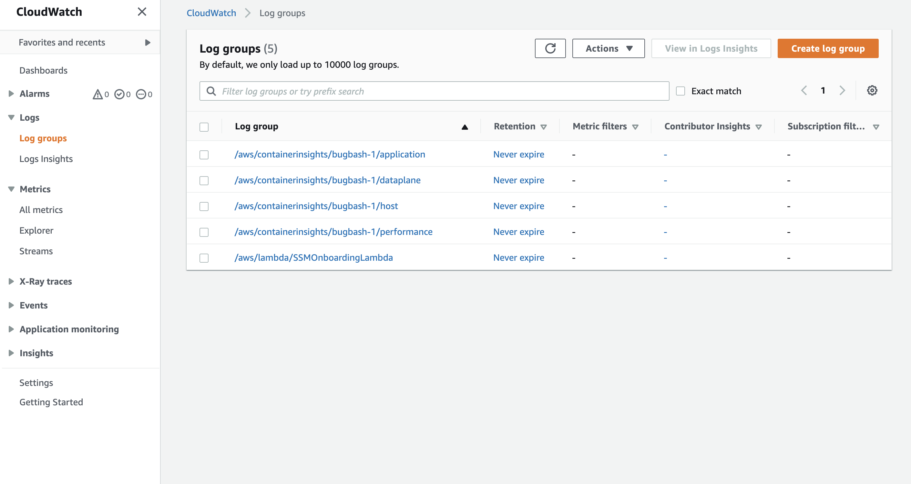
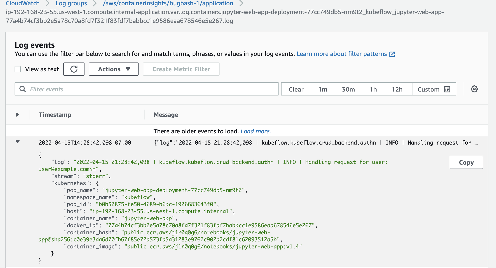
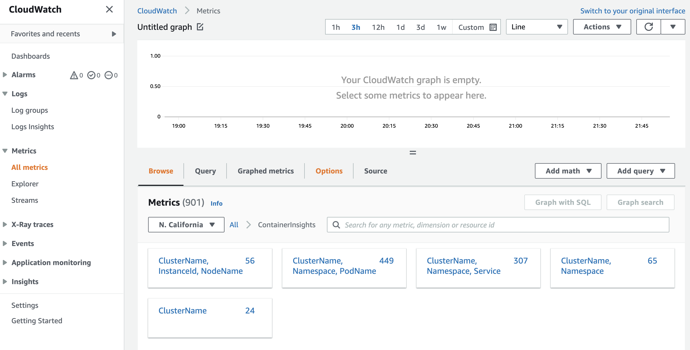
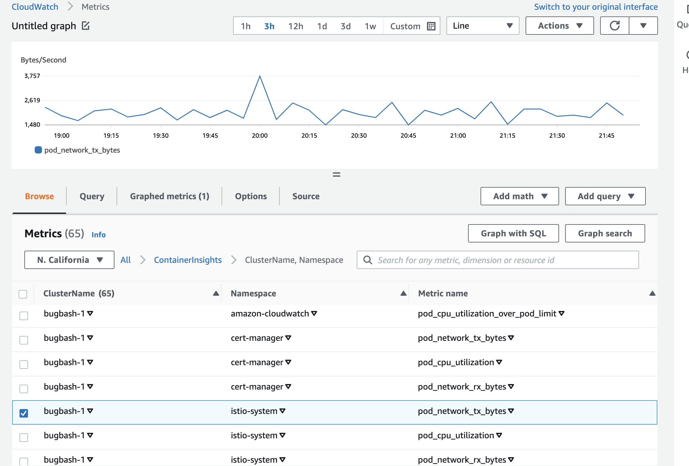

# Installing CloudWatch ContainerInsights on EKS

## Verify Prerequisites
The EKS Cluster will need IAM service account roles associated with CloudWatchAgentServerPolicy attached.
 ```
export CLUSTER_NAME=<>
export CLUSTER_REGION=<>

eksctl utils associate-iam-oidc-provider --region=$CLUSTER_REGION --cluster=$CLUSTER_NAME --approve
eksctl create iamserviceaccount --name cloudwatch-agent --namespace amazon-cloudwatch --cluster $CLUSTER_NAME --region $CLUSTER_REGION --role-name cloudwatch-agent --approve --override-existing-serviceaccounts --attach-policy-arn arn:aws:iam::aws:policy/CloudWatchAgentServerPolicy
eksctl create iamserviceaccount --name fluent-bit --namespace amazon-cloudwatch --cluster $CLUSTER_NAME --region $CLUSTER_REGION --role-name fluent-bit --approve --override-existing-serviceaccounts --attach-policy-arn arn:aws:iam::aws:policy/CloudWatchAgentServerPolicy
```

## Install

To install an optimized quick start configuration enter the following command.
```
FluentBitHttpPort='2020'
FluentBitReadFromHead='Off'
[[ ${FluentBitReadFromHead} = 'On' ]] && FluentBitReadFromTail='Off'|| FluentBitReadFromTail='On'
[[ -z ${FluentBitHttpPort} ]] && FluentBitHttpServer='Off' || FluentBitHttpServer='On'
curl https://raw.githubusercontent.com/aws-samples/amazon-cloudwatch-container-insights/latest/k8s-deployment-manifest-templates/deployment-mode/daemonset/container-insights-monitoring/quickstart/cwagent-fluent-bit-quickstart.yaml | sed 's/{{cluster_name}}/'${CLUSTER_NAME}'/;s/{{region_name}}/'${CLUSTER_REGION}'/;s/{{http_server_toggle}}/"'${FluentBitHttpServer}'"/;s/{{http_server_port}}/"'${FluentBitHttpPort}'"/;s/{{read_from_head}}/"'${FluentBitReadFromHead}'"/;s/{{read_from_tail}}/"'${FluentBitReadFromTail}'"/' | kubectl apply -f - 
```

To verify the installation you can run the following command to see that metrics have been created. Note that it may take up to 15 minutes for the metrics to populate.

```
aws cloudwatch list-metrics --namespace ContainerInsights --region $CLUSTER_REGION
```

An example of the logs which will be available after installation are the logs of the pods on your cluster. This way the pod logs can still be accessed past their default storage time. Also allows for an easy way to view logs for all pods on your cluster without having to directly connect to your EKS cluster. 

The logs can be accessed by through CloudWatch log groups 


To view individual pod logs select /aws/containerinsights/YOUR_CLUSTER_NAME/application 


Here is an example of the jupyter-web-app pods logs available through CloudWatch 


An example of the metrics that will be available after installation are pod_network_tx_bytes. The full list of metrics that are provided by default can be found [here](https://docs.aws.amazon.com/AmazonCloudWatch/latest/monitoring/Container-Insights-metrics-EKS.html)

The metrics are grouped by varying different parameters such as Cluster,Namespace,PodName


An example of the graphed metrics for the istio-system namespace which deals with internet traffic


The following guide provides instructions on viewing CloudWatch metrics https://docs.aws.amazon.com/AmazonCloudWatch/latest/monitoring/viewing_metrics_with_cloudwatch.html the metric namespace to select is ContainerInsights

You can see the full list of logs and metrics through https://console.aws.amazon.com/cloudwatch/


## Uninstall
To uninstall CloudWatch ContainerInsights enter the following command.
```
curl https://raw.githubusercontent.com/aws-samples/amazon-cloudwatch-container-insights/latest/k8s-deployment-manifest-templates/deployment-mode/daemonset/container-insights-monitoring/quickstart/cwagent-fluent-bit-quickstart.yaml | sed 's/{{cluster_name}}/'${ClusterName}'/;s/{{region_name}}/'${LogRegion}'/;s/{{http_server_toggle}}/"'${FluentBitHttpServer}'"/;s/{{http_server_port}}/"'${FluentBitHttpPort}'"/;s/{{read_from_head}}/"'${FluentBitReadFromHead}'"/;s/{{read_from_tail}}/"'${FluentBitReadFromTail}'"/' | kubectl delete -f -
```

## Additional Information
Full documentation and additional configuration options are available through EKS [documentation](https://docs.aws.amazon.com/AmazonCloudWatch/latest/monitoring/Container-Insights-setup-EKS-quickstart.html)