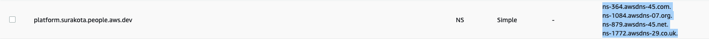
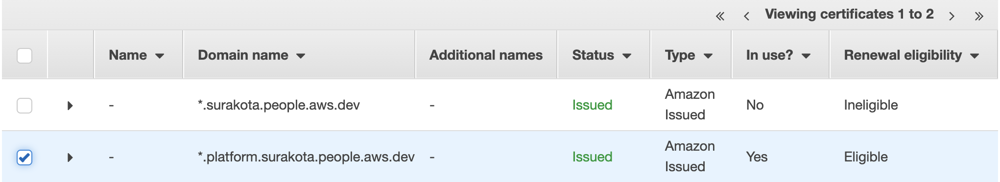

# Exposing Kubeflow over Load Balancer

This tutorial shows how to expose Kubeflow over a load balancer on AWS.

## Before you begin

Follow this guide only if you are **not** using `Cognito` as the authentication provider in your deployment. Cognito integrated deployment is configured with AWS Load Balancer controller by default to create an ingress managed application load balancer and exposes Kubeflow via a hosted domain.

## Background

Kubeflow does not offer a generic solution for connecting to Kubeflow over a load balancer because this process is highly dependent on your environment/cloud provider. On AWS, we use the [AWS Load Balancer controller](https://kubernetes-sigs.github.io/aws-load-balancer-controller/) which satisfies the Kubernetes [Ingress resource](https://kubernetes.io/docs/concepts/services-networking/ingress/) to create an [Application Load Balancer](https://docs.aws.amazon.com/elasticloadbalancing/latest/application/introduction.html) (ALB). When you create a Kubernetes `Ingress`, an ALB is provisioned that load balances application traffic.

In order to connect to Kubeflow using a LoadBalancer, we need to setup HTTPS. The reason is that many of the Kubeflow web apps (e.g., Tensorboard Web App, Jupyter Web App, Katib UI) use [Secure Cookies](https://developer.mozilla.org/en-US/docs/Web/HTTP/Cookies#restrict_access_to_cookies), so accessing Kubeflow with HTTP over a non-localhost domain does not work.

To secure the traffic and use HTTPS, we must associate a Secure Sockets Layer/Transport Layer Security (SSL/TLS) certificate with the load balancer. [AWS Certificate Manager](https://aws.amazon.com/certificate-manager/) is a service that lets you easily provision, manage, and deploy public and private Secure Sockets Layer/Transport Layer Security (SSL/TLS) certificates for use with AWS services and your internal connected resources. To create a certificate for use with the load balancer, [you must specify a domain name](https://docs.aws.amazon.com/elasticloadbalancing/latest/application/create-https-listener.html#https-listener-certificates) i.e. certificates cannot be created for ALB DNS. You can register your domain using any domain service provider such as [Route53](https://aws.amazon.com/route53/), GoDoddy etc.

## Prerequisites

1. Kubeflow deployment on EKS with Dex as auth provider(default in [Vanilla](../../vanilla/README.md) Kubeflow).
1. Installed the tools mentioned in [prerequisite section of this](../../vanilla/README.md#prerequisites) document on the client machine.
1. Verify you are connected to right cluster, cluster has compute and the aws region is set to the region of cluster.
    1. Verify cluster name and region are exported
        ```
        echo $CLUSTER_REGION
        echo $CLUSTER_NAME
        ```
    1. Display the current cluster kubeconfig points to
        ```
        kubectl config current-context
        aws eks describe-cluster --name $CLUSTER_NAME
        ```
1. Verify the current directory is the root of the repository by running the `pwd` command. The output should be `<path/to/kubeflow-manifests>` directory


## Create Load Balancer

To make it easy to create the load balancer, you can use the [script provided in this section](#automated-script). If you prefer to use the automated scripts, you need to only execute the steps in the [automated script section](#automated-script). Read the following sections in this guide to understand what happens when you run the script or execute all the steps if you prefer to do it manually/hands-on.

### Create Domain and Certificates

As explained in the background section, you need a registered domain and TLS certificate to use HTTPS with load balancer. Since your top level domain(e.g. `example.com`) could have been registered at any service provider, for uniformity and taking advantage of the integration provided between Route53, ACM and Application Load Balancer, you will create a separate [sudomain](https://en.wikipedia.org/wiki/Subdomain) (e.g. `platform.example.com`) to host Kubeflow and a corresponding hosted zone in Route53 to route traffic for this subdomain. To get TLS support, you will need certificates for both the root domain(`*.example.com`) and subdomain(`*.platform.example.com`) in the region where your platform will be running(i.e. EKS cluster region).

#### Create a subdomain

1. Register a domain in any domain provider like [Route 53](https://docs.aws.amazon.com/Route53/latest/DeveloperGuide/domain-register.html) or GoDaddy.com etc. Lets assume this domain is `example.com`. It is handy to have a domain managed by Route53 to deal with all the DNS records you will have to add (wildcard for ALB DNS, validation for the certificate manager, etc)
1. Goto Route53 and create a subdomain to host kubeflow:
    1. Create a hosted zone for the desired subdomain e.g. `platform.example.com`.
    1. Copy the value of NS type record from the subdomain hosted zone (`platform.example.com`)
        1. 
    1. Create a `NS` type of record in the root `example.com` hosted zone for the subdomain `platform.example.com`.
        1. 
        1.  Following is a screenshot of the record after creation in `example.com` hosted zone.
            1. 

From this point onwards, we will be creating/updating the DNS records **only in the subdomain**. All the screenshots of hosted zone in the following sections/steps of this guide are for the subdomain.
#### Create certificates for domain

Create the certificates for the domains in the region where your platform will be running(i.e. EKS cluster region) by following [this document](https://docs.aws.amazon.com/acm/latest/userguide/gs-acm-request-public.html#request-public-console) in the specified order.

> **Note:**
> - The ceritificates are valid only after successful [validation of domain ownership](https://docs.aws.amazon.com/acm/latest/userguide/domain-ownership-validation.html)
    - Following is a screenshot showing a certificate has been issued. Note: Status turns to `Issued` after few minutes of validation.
        - 
> - If you choose DNS validation for the validation of the certificates, you will be asked to create a CNAME type record in the hosted zone.
    - Following is a screenshot of CNAME record of the certificate in `platform.example.com` hosted zone for DNS validation:
            -     

1. Create a certificate for `*.example.com` in the region where your platform will be running
1. Create a certificate for `*.platform.example.com` in the region where your platform will be running

### Configure Ingress

1. Export the ARN of the certificate created for `*.platform.example.com`:
        1. `export certArn=<>`
1. Configure the parameters for [ingress](../../../../awsconfigs/common/istio-ingress/overlays/https/params.env) with the certificate ARN of the subdomain
    1. ```
        printf 'certArn='$certArn'' > awsconfigs/common/istio-ingress/overlays/https/params.env
        ```
### Configure Load Balancer Controller

Setup resources required for the load balancer controller:

1. Make sure all the subnets(public and private) corresponding to the EKS cluster are tagged according to the `Prerequisites` section in this [document](https://docs.aws.amazon.com/eks/latest/userguide/alb-ingress.html). Ignore the requirement to have an existing ALB provisioned on the cluster. We will be deploying load balancer controller version 1.1.5 in the later section.
    1. Specifically check if the following tags exist on the subnets:
        1. `kubernetes.io/cluster/cluster-name` (replace `cluster-name` with your cluster name e.g. `kubernetes.io/cluster/my-k8s-cluster`). Add this tag in both private and public subnets. If you created the cluster using eksctl, you might be missing only this tag. Use the following command to tag all subnets by substituting the value of `TAG_VALUE` variable(`owned` or `shared`). Use `shared` as tag value if you have more than one cluster using the subnets:
            - ```
                export TAG_VALUE=<>
                export CLUSTER_SUBNET_IDS=$(aws ec2 describe-subnets --region $CLUSTER_REGION --filters Name=tag:alpha.eksctl.io/cluster-name,Values=$CLUSTER_NAME --output json | jq -r '.Subnets[].SubnetId')
                for i in "${CLUSTER_SUBNET_IDS[@]}"
                do
                    aws ec2 create-tags --resources ${i} --tags Key=kubernetes.io/cluster/${CLUSTER_NAME},Value=${TAG_VALUE}
                done
                ```
        1. `kubernetes.io/role/internal-elb`. Add this tag only to private subnets
        1. `kubernetes.io/role/elb`. Add this tag only to public subnets
1. Load balancer controller will use [IAM roles for service accounts](https://docs.aws.amazon.com/eks/latest/userguide/iam-roles-for-service-accounts.html)(IRSA) to access AWS services. An OIDC provider must exist for your cluster to use IRSA. Create an OIDC provider and associate it with for your EKS cluster by running the following command if your cluster doesn’t already have one:
    1.  ```
        eksctl utils associate-iam-oidc-provider --cluster ${CLUSTER_NAME} --region ${CLUSTER_REGION} --approve
        ```
1. Create an IAM role with [these permissions](../../../../awsconfigs/infra_configs/iam_alb_ingress_policy.json) for the load balancer controller to use via a service account to access AWS services.
    1. ```
        export LBC_POLICY_NAME=alb_ingress_controller_${CLUSTER_REGION}_${CLUSTER_NAME}
        export LBC_POLICY_ARN=$(aws iam create-policy --policy-name $LBC_POLICY_NAME --policy-document file://awsconfigs/infra_configs/iam_alb_ingress_policy.json --output text --query 'Policy.Arn')
        eksctl create iamserviceaccount --name aws-load-balancer-controller --namespace kube-system --cluster ${CLUSTER_NAME} --region ${CLUSTER_REGION} --attach-policy-arn ${LBC_POLICY_ARN} --override-existing-serviceaccounts --approve
        ```
1. Configure the parameters for [load balancer controller](../../../../awsconfigs/common/aws-alb-ingress-controller/base/params.env) with the cluster name
    1. ```
        printf 'clusterName='$CLUSTER_NAME'' > awsconfigs/common/aws-alb-ingress-controller/base/params.env
        ```

### Build Manifests and deploy components
Run the following command to build and install the components specified in this [kustomize](./kustomization.yaml) file.
```
kustomize build docs/deployment/add-ons/load-balancer | kubectl apply -f -
```

### Update the domain with ALB address

1. Check if ALB is provisioned. It takes around 3-5 minutes
    1. ```
        kubectl get ingress -n istio-system istio-ingress
        NAME            CLASS    HOSTS   ADDRESS                                                                  PORTS   AGE
        istio-ingress   <none>   *       xxxxxx-istiosystem-istio-2af2-1100502020.us-west-2.elb.amazonaws.com   80      15d
        ```
    2. If `ADDRESS` is empty after a few minutes, check the logs of controller by following [this guide](https://www.kubeflow.org/docs/distributions/aws/troubleshooting-aws/#alb-fails-to-provision)
1. When ALB is ready, copy the DNS name of that load balancer and create a CNAME entry to it in Route53 under subdomain (`platform.example.com`) for `*.platform.example.com`
    1. 

1. The central dashboard should now be available at `https://kubeflow.platform.example.com`. Open a browser and navigate to this URL.

### Automated script

1. Install dependencies for the script
    ```
    cd tests/e2e
    pip install -r requirements.txt
    ```
1. Substitute values in `tests/e2e/utils/load_balancer/config.yaml`.
    1. Registed root domain in `route53.rootDomain.name`. Lets assume this domain is `example.com`
        1. If your domain is managed in route53, enter the Hosted zone ID found under Hosted zone details in `route53.rootDomain.hostedZoneId`. Skip this step if your domain is managed by other domain provider.
    1. Name of the sudomain you want to host Kubeflow (e.g. `platform.example.com`) in `route53.subDomain.name`.
    1. Cluster name and region where kubeflow is deployed in `cluster.name` and `cluster.region` (e.g. us-west-2) respectively.
    1. The config file will look something like:
        1. ```
            cluster:
                name: kube-eks-cluster
                region: us-west-2
            route53:
                rootDomain:
                    hostedZoneId: XXXX
                    name: example.com
                subDomain:
                    name: platform.example.com
            ```
1. Run the script to create the resources
    1. ```
        PYTHONPATH=.. python utils/load_balancer/setup_load_balancer.py
        ```
1. The script will update the config file with the resource names/ids/ARNs it created. Following is a sample:
    1. ```
        kubeflow:
            alb:
                dns: xxxxxx-istiosystem-istio-2af2-1100502020.us-west-2.elb.amazonaws.com
                serviceAccount:
                    name: alb-ingress-controller
                    namespace: kubeflow
                    policyArn: arn:aws:iam::123456789012:policy/alb_ingress_controller_kube-eks-clusterxxx
        cluster:
            name: kube-eks-cluster
            region: us-west-2
        route53:
            rootDomain:
                certARN: arn:aws:acm:us-west-2:123456789012:certificate/9d8c4bbc-3b02-4a48-8c7d-d91441c6e5af
                hostedZoneId: XXXXX
                name: example.com
            subDomain:
                certARN: arn:aws:acm:us-west-2:123456789012:certificate/d1d7b641c238-4bc7-f525-b7bf-373cc726
                hostedZoneId: XXXXX
                name: platform.example.com
        ```
1. The central dashboard should now be available at `https://kubeflow.platform.example.com`. Open a browser and navigate to this URL.

## Clean up

To delete the resources created in this guide, run the following commands from the root of repository:
Make sure you have the configuration file created by the script in `tests/e2e/utils/load_balancer/config.yaml`. If you did not use the script, plugin the name/ARN/id of the resources you created in the configuration file by referring the sample in Step 4 of [previous section](#automated-script)

```
cd tests/e2e
PYTHONPATH=.. python utils/load_balancer/lb_resources_cleanup.py
cd -
```