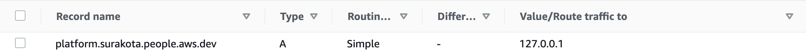
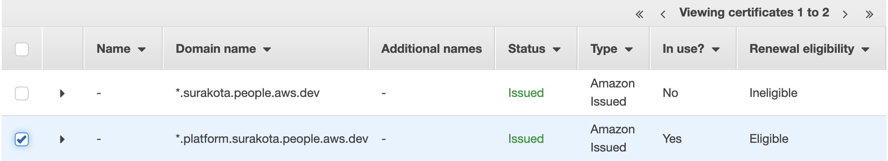
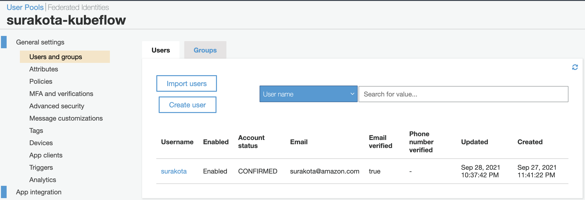
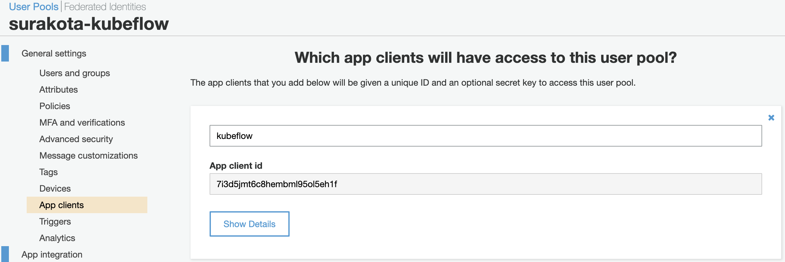
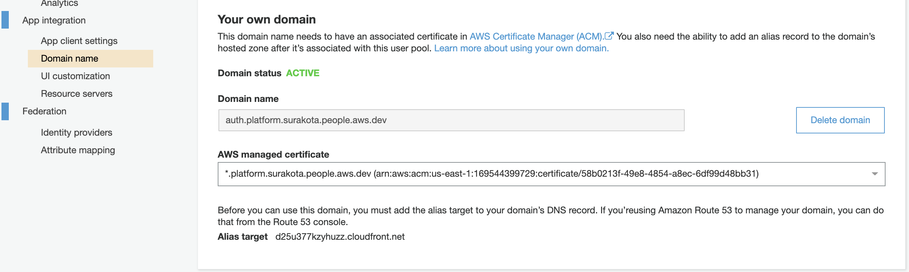
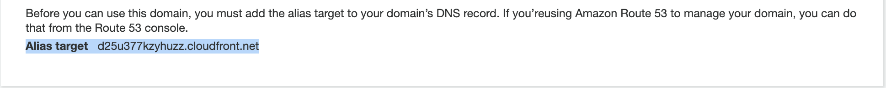

# Deploying Kubeflow with AWS Cognito as idP

This guide describes how to deploy Kubeflow on AWS EKS using Cognito as identity provider.

## 1.0 Custom domain

Register a domain in any domain provider like [Route 53](https://docs.aws.amazon.com/Route53/latest/DeveloperGuide/domain-register.html) or GoDaddy.com etc. Lets assume this domain is `example.com`. It is handy to have a domain managed by Route53 to deal with all the DNS records you will have to add (wildcard for istio-ingressgateway, validation for the certificate manager, etc). In case your `example.com` zone is not managed by Route53, you need to delegate a [subdomain management in a Route53 hosted zone](https://docs.aws.amazon.com/Route53/latest/DeveloperGuide/CreatingNewSubdomain.html). For uniformity, we have delegated the subdomain `platform.example.com` in this guide so your domain can be registered anywhere. Follow these steps to configure the subdomain:

1. Goto Route53 and create a subdomain to host kubeflow:
    1. Create a hosted zone for the desired subdomain e.g. `platform.example.com`.
    2. Copy the NS entries created for the subdomain (`platform.example.com`) and create a `NS` type of record in the root `example.com` zone. Following is a screenshot of `example.com`  hosted zone.
        1. 
2. From this step onwards, we will be creating/updating the DNS records only in the subdomain. All the screenshots of hosted zone in the following sections/steps guide are for the subdomain.
3. In order to make Cognito to use custom domain name, A record is required to resolve `platform.example.com` as root domain, which can be a Route53 Alias to the ALB as well. Create a new record of type `A` with an arbitrary IP for now. Once we have ALB created, we will update the value later.
    1. Following is a screenshot of `platform.example.com` hosted zone. A record is shown. 
        1. 

## 2.0 Certificate

Create two certificates in Certificate Manager for each `*.example.com` and `*.platform.example.com` in respective order by following [this document](https://docs.aws.amazon.com/acm/latest/userguide/gs-acm-request-public.html#request-public-console). One in N.Virginia and one in the region where your platform is running. That is because Cognito [requires](https://docs.aws.amazon.com/cognito/latest/developerguide/cognito-user-pools-add-custom-domain.html) a certificate in N.Virginia in order to have a custom domain for a user pool. The second is required by the ingress-gateway in case the platform does not run in N.Virginia, in our example Oregon. For the validation of both certificates, you will be asked to create one record in the hosted zone we created above.

1. Following is a screenshot showing an issued certificate. See highlighted. Note: Status turns to issued after few minutes of **creating the record in hosted zone**.
    1. 
2. Following is a screenshot of [platform.example.com](http://platform.example.com/) hosted zone showing the certificate has been added:
    1. 

## 3.0 Cognito User Pool

1. Create a user pool in Cognito. Type a pool name and choose `Review defaults` and `Create pool`.
2. Create some users in `Users and groups`, these are the users who will login to the central dashboard.
    1. 
3. Add an `App client` with any name and the default options.
    1. 
4. In the `App client settings`, select `Authorization code grant` flow under OAuth-2.0 and check box `email`, `openid`, `aws.cognito.signin.user.admin` and `profile` scopes. Also check box `Enabled Identity Providers`. 
    1. Use `https://kubeflow.platform.example.com/oauth2/idpresponse` in the Callback URL(s).
    2. 
5. In the `Domain name` choose `Use your domain`, type `auth.platform.example.com` and select the `*.platform.example.com` AWS managed certificate you’ve created in N.Virginia. Creating domain takes up to 15 mins.
    1. 
    2. When it’s created, it will return the `Alias target` CloudFront address for which you need to create  a type `A` record  `auth.platform.example.com` in the hosted zone.
        1. Screenshot of the CloudFront URL for Cognito Domain name:
            1. 
        2. Screenshot of the A record in `platform.example.com` hosted zone:
            1. 
6. Take note of the following values:
    1. The Pool ARN of the user pool found in Cognito general settings.
    2. The App client id, found in Cognito App clients.
    3. The custom user pool domain (e.g. `auth.platform.example.com`), found in the Cognito domain name.
    4. The ARN of the certificate from the Certificate Manager in the region where your platform is running.
    5. Export the values:
        1. ```
            export CognitoUserPoolArn=<>
            export CognitoAppClientId=<>
            export CognitoUserPoolDomain=<>
            export certArn=<>
            ```

## 4.0 Building manifests and deploying Kubeflow

1. Verify you are connected to right cluster, cluster has compute and the **aws default region** points to the region of cluster.
    1. ```
        # Display default region
        aws configure get region

        # Display the current cluster connected to
        kubectl config current-context
        kubectl get nodes
        aws eks describe-cluster --cluster-name $CLUSTER_NAME
        ```
2. Clone the `awslabs/kubeflow-manifest` repo.
    1. ```
        git clone https://github.com/awslabs/kubeflow-manifests.git
        cd kubeflow-manifests
        git checkout v1.3-branch
        ```
3. Substitute values for setting up Ingress.
    1. ```
        printf '
        CognitoUserPoolArn='$CognitoUserPoolArn'
        CognitoAppClientId='$CognitoAppClientId'
        CognitoUserPoolDomain='$CognitoUserPoolDomain'
        certArn='$certArn'
        loadBalancerScheme=internet-facing
        ' > distributions/aws/istio-ingress/overlays/cognito/params.env
        ```
4. Setup resources required for ALB controller
    1. Make sure all subnets are tagged properly according to the [prerequisites in this document](https://docs.aws.amazon.com/eks/latest/userguide/alb-ingress.html). We are using ALB controller version 1.1.5.
        1. Specifically look for the following tags:
            1. `kubernetes.io/cluster/cluster-name` (replace cluster-name with your cluster name). If you created the cluster using eksctl, you might be missing only this tag
            2. `kubernetes.io/role/internal-elb`
            3. `kubernetes.io/role/elb`
    2. Create an IAM role to use via service account
        1. Substitute values for the CLUSTER_NAME and AWS_REGION in the script below
        2. ```
            # Replace the CLUSTER_NAME and AWS_REGION
            export CLUSTER_NAME=<>
            export AWS_REGION=<>
            export AWS_ACCOUNT_ID=$(aws sts get-caller-identity --query "Account" --output text)
            
            eksctl utils associate-iam-oidc-provider --cluster ${CLUSTER_NAME} \
            --region ${AWS_REGION} --approve
            
            export OIDC_PROVIDER_URL=$(aws eks describe-cluster --name $CLUSTER_NAME --region $AWS_REGION --query "cluster.identity.oidc.issuer" --output text | cut -c9-)
            export IRSA_ROLE_NAME=kf-admin-${AWS_REGION}-${CLUSTER_NAME}
            
            printf '{
                "Version": "2012-10-17",
                "Statement": [
                {
                    "Effect": "Allow",
                    "Principal": {
                    "Federated": "arn:aws:iam::'$AWS_ACCOUNT_ID':oidc-provider/'$OIDC_PROVIDER_URL'"
                    },
                    "Action": "sts:AssumeRoleWithWebIdentity",
                    "Condition": {
                    "StringEquals": {
                        "'$OIDC_PROVIDER_URL':aud": "sts.amazonaws.com",
                        "'$OIDC_PROVIDER_URL':sub": [
                        "system:serviceaccount:kubeflow:fluentd",
                        "system:serviceaccount:kubeflow:kf-admin",
                        "system:serviceaccount:kubeflow:alb-ingress-controller",
                        "system:serviceaccount:kubeflow:profiles-controller-service-account"
                        ]
                    }
                    }
                }
                ]
            }
            ' > ./trust.json
            
            
            aws iam create-role --role-name $IRSA_ROLE_NAME --assume-role-policy-document file://trust.json
            aws iam put-role-policy --role-name $IRSA_ROLE_NAME --policy-name iam_alb_ingress_policy --policy-document file://distributions/aws/infra_configs/iam_alb_ingress_policy.json
            aws iam put-role-policy --role-name $IRSA_ROLE_NAME --policy-name iam_profile_controller_policy --policy-document file://distributions/aws/infra_configs/iam_profile_controller_policy.json
            
            export IAM_ROLE_ARN_FOR_IRSA=$(aws iam get-role --role-name $IRSA_ROLE_NAME --output text --query 'Role.Arn')
            ```
    3. Substitute values for ALB deployment
        1. ```
            printf 'clusterName='$CLUSTER_NAME'' > distributions/aws/aws-alb-ingress-controller/base/params.env
            ```
5. Deploy Kubeflow
    1. ```
        # Kubeflow namespace
        kustomize build common/kubeflow-namespace/base | kubectl apply -f -
        
        # Kubeflow Roles
        kustomize build common/kubeflow-roles/base | kubectl apply -f -
        
        # Istio
        kustomize build common/istio-1-9/istio-crds/base | kubectl apply -f -
        kustomize build common/istio-1-9/istio-namespace/base | kubectl apply -f -
        kustomize build common/istio-1-9/istio-install/base | kubectl apply -f -
        
        # Cert-Manager
        kustomize build common/cert-manager/cert-manager/base | kubectl apply -f -
        kustomize build common/cert-manager/kubeflow-issuer/base | kubectl apply -f -
        
        # KNative
        kustomize build common/knative/knative-serving/base | kubectl apply -f -
        kustomize build common/knative/knative-eventing/base | kubectl apply -f -
        kustomize build common/istio-1-9/cluster-local-gateway/base | kubectl apply -f -
        
        # Kubeflow Istio Resources
        kustomize build common/istio-1-9/kubeflow-istio-resources/base | kubectl apply -f -
        
        # Kubeflow Pipelines
        # reapply manifest if you see an error
        kustomize build apps/pipeline/upstream/env/platform-agnostic-multi-user | kubectl apply -f -
        
        # KFServing
        kustomize build apps/kfserving/upstream/overlays/kubeflow | kubectl apply -f -
        
        # Katib
        kustomize build apps/katib/upstream/installs/katib-with-kubeflow | kubectl apply -f -
        
        # Central Dashboard
        kustomize build apps/centraldashboard/upstream/overlays/istio | kubectl apply -f -
        
        # Notebooks
        kustomize build apps/jupyter/notebook-controller/upstream/overlays/kubeflow | kubectl apply -f -
        kustomize build apps/jupyter/jupyter-web-app/upstream/overlays/istio | kubectl apply -f -
        
        # Admission Webhook
        kustomize build apps/admission-webhook/upstream/overlays/cert-manager | kubectl apply -f -
        
        # Profiles + KFAM
        kustomize build apps/profiles/upstream/overlays/kubeflow | kubectl apply -f -
        
        # Volumes Web App
        kustomize build apps/volumes-web-app/upstream/overlays/istio | kubectl apply -f -
        
        # Tensorboard
        kustomize build apps/tensorboard/tensorboards-web-app/upstream/overlays/istio | kubectl apply -f -
        kustomize build apps/tensorboard/tensorboard-controller/upstream/overlays/kubeflow | kubectl apply -f -
        
        # TFJob Operator
        kustomize build apps/tf-training/upstream/overlays/kubeflow | kubectl apply -f -
        
        # Pytorch Operator
        kustomize build apps/pytorch-job/upstream/overlays/kubeflow | kubectl apply -f -
        
        # MPI Operator
        kustomize build apps/mpi-job/upstream/overlays/kubeflow | kubectl apply -f -
        
        # MXNet Operator
        kustomize build apps/mxnet-job/upstream/overlays/kubeflow | kubectl apply -f -
        
        # XGBoost Operator
        kustomize build apps/xgboost-job/upstream/overlays/kubeflow | kubectl apply -f -

        # Ingress
        kustomize build distributions/aws/istio-ingress/overlays/cognito | kubectl apply -f -

        # ALB controller
        kustomize build distributions/aws/aws-alb-ingress-controller/base | kubectl apply -f -

        # Envoy filter
        kustomize build distributions/aws/aws-istio-envoy-filter/base | kubectl apply -f -
        ```
    2. Annotate the service account with the IAM role
        1. ```
            kubectl annotate serviceaccount -n kubeflow alb-ingress-controller eks.amazonaws.com/role-arn=$IAM_ROLE_ARN_FOR_IRSA
            kubectl annotate serviceaccount -n kubeflow profiles-controller-service-account eks.amazonaws.com/role-arn=$IAM_ROLE_ARN_FOR_IRSA
            ```
    3. Check if ALB is provisioned. It takes around 3-5 minutes
        1. ```
            kubectl get ingress -n istio-system
            Warning: extensions/v1beta1 Ingress is deprecated in v1.14+, unavailable in v1.22+; use networking.k8s.io/v1 Ingress
            NAME            CLASS    HOSTS   ADDRESS                                                                  PORTS   AGE
            istio-ingress   <none>   *       ebde55ee-istiosystem-istio-2af2-1100502020.us-west-2.elb.amazonaws.com   80      15d
            ```
        2. If `ADDRESS` is empty after a few minutes, check the logs of alb-ingress-controller by following [this guide](https://www.kubeflow.org/docs/distributions/aws/troubleshooting-aws/#alb-fails-to-provision)
    4. When ALB is ready, copy the DNS name of that load balancer and create 2 CNAME entries to it in Route53 under subdomain (`platform.example.com`) for `*.platform.example.com` and `*.default.platform.example.com`
        1. 
    5. Update the type `A` record created in section for `platform.example.com` using ALB DNS name. Change from `127.0.0.1` → ALB DNS name. You have to use alias form under `Alias to application and classical load balancer` and select region and your ALB address.
        1. 
    6. Screenshot of all the record sets in hosted zone for reference
        1. 

## 5.0 Connecting to Central dashboard

1. The central dashboard should now be available at [https://kubeflow.platform.example.com](https://kubeflow.platform.example.com/). Before connecting to the dashboard, create a profile for a user from the Cognito user pool by [following this guide](https://www.kubeflow.org/docs/components/multi-tenancy/getting-started/#manual-profile-creation). Following is a sample profile for reference:
    1. ```
        apiVersion: kubeflow.org/v1beta1
        kind: Profile
        metadata:
            # replace with the name of profile you want, this will be user's namespace name
            name: my-user
            namespace: kubeflow
        spec:
            owner:
            kind: User
            # replace with the email of the user
            name: user_email@kubeflow.com
        ```
2. Open the central dashboard at [https://kubeflow.platform.example.com](https://kubeflow.platform.example.com/). It will redirect to Cognito for login. Use the credentials of the user for which profile was created in previous step.